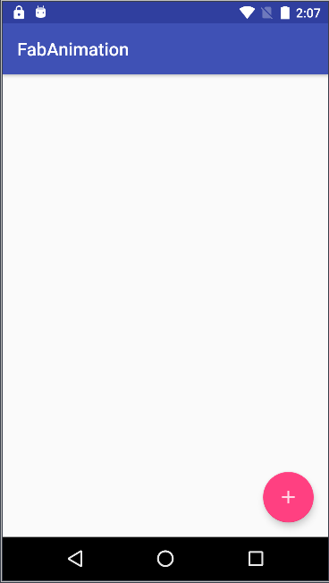
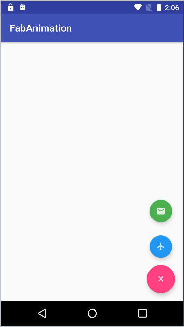

# FloatingActionButton控件学习

##Screenshots





## 1. 导入库

```groovy
implementation 'com.android.support:design:27.1.1'
```

## 2. 在xml中引用

```xml
<android.support.design.widget.FloatingActionButton
        android:id="@+id/fab_plus"
        android:layout_width="wrap_content"
        android:layout_height="wrap_content"
        android:layout_gravity="bottom|end"
        android:layout_marginBottom="16dp"
        android:layout_marginEnd="16dp"
        android:elevation="6dp"
        app:pressedTranslationZ="12dp"
        app:srcCompat="@drawable/ic_add"></android.support.design.widget.FloatingActionButton>
```

| 属性                | 意义                                        |
| ------------------- | ------------------------------------------- |
| elevation           | 权重，按钮阴影                              |
| pressedTranslationZ | 按钮点下之后的阴影，设置时比elevation值要大 |
| srcCompat           | 设置按钮图标                                |


## 3. 添加动画

close.xml

```xml
<?xml version="1.0" encoding="utf-8"?>
<set xmlns:android="http://schemas.android.com/apk/res/android"
    android:fillAfter="true">
    <!--尺寸动画-->
    <scale
        android:duration="300"
        android:fromXScale="0.8"
        android:fromYScale="0.8"
        android:interpolator="@android:anim/linear_interpolator"
        android:pivotX="50%"
        android:pivotY="50%"
        android:toXScale="0.0"
        android:toYScale="0.0" />
    <!--透明度渐变-->
    <alpha
        android:duration="300"
        android:fromAlpha="1.0"
        android:interpolator="@android:anim/accelerate_interpolator"
        android:toAlpha="0.0" />
</set>
```

open.xml

```xml
<?xml version="1.0" encoding="utf-8"?>
<set xmlns:android="http://schemas.android.com/apk/res/android"
    android:fillAfter="true">
    <!--尺寸动画-->
    <scale
        android:duration="300"
        android:fromXScale="0.0"
        android:fromYScale="0.0"
        android:interpolator="@android:anim/linear_interpolator"
        android:pivotX="50%"
        android:pivotY="50%"
        android:toXScale="0.8"
        android:toYScale="0.8" />
    <!--透明度渐变-->
    <alpha
        android:duration="300"
        android:fromAlpha="0.0"
        android:interpolator="@android:anim/accelerate_interpolator"
        android:toAlpha="1.0" />
</set>
```

rotate_clockwise.xml

```xml
<?xml version="1.0" encoding="utf-8"?>
<set xmlns:android="http://schemas.android.com/apk/res/android"
    android:fillAfter="true">
    <rotate
        android:duration="300"
        android:fromDegrees="0"
        android:toDegrees="45"
        android:pivotX="50%"
        android:interpolator="@android:anim/linear_interpolator"
        android:pivotY="50%"/>
</set>
```

rotate_anitclockwise.xml

```xml
<?xml version="1.0" encoding="utf-8"?>
<set xmlns:android="http://schemas.android.com/apk/res/android"
    android:fillAfter="true">
    <rotate
        android:duration="300"
        android:fromDegrees="45"
        android:interpolator="@android:anim/linear_interpolator"
        android:pivotX="50%"
        android:pivotY="50%"
        android:toDegrees="0" />
</set>
```

| 属性         | 意义                                       |
| ------------ | ------------------------------------------ |
| fillAfter    | 动画结束时停留在动画最后一帧               |
| fillBefore   | 动画结束时停留在动画的第一帧               |
| interpolator | 插补器（插值器）控制动画的变化速率，加速度 |

